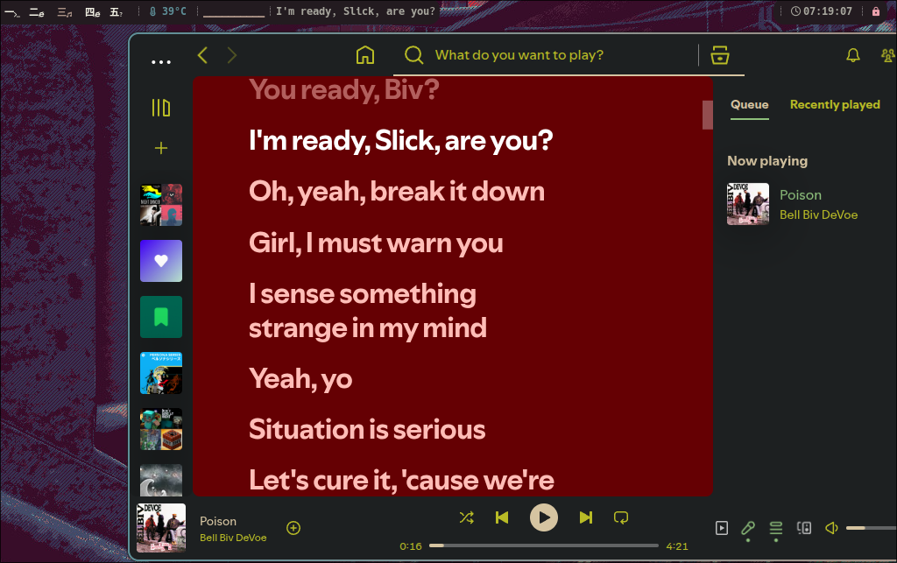

# Lyrics Program!

[](https://crates.io/crates/lyrical)
[](https://github.com/tblelrd/lyrical)

Simple lyrics program that you can use for something like
waybar.

Using [lrclib.net](https://lrclib.net/) to request lyrics.

No AI was used for the creation of this program!

## Notable Features

- Automatically romanizes chinese, japanese, and korean lyrics.
  (Can be toggled per language, see [usage section](#usage))
- Caching (grows infinitely as of right now, will fix very soon)

## Demo Image



# Installation

Make sure you have `playerctl` in your `$PATH`.
(The package to install is usually just called `playerctl`).

## Cargo (crates.io)

Install the program from [crates.io](https://crates.io/crates/lyrical).

```sh
cargo install lyrical
```

Cargo will build the `lyrical` binary and place it in your `CARGO_INSTALL_ROOT`.
For more details on installation location see [the cargo book](https://doc.rust-lang.org/cargo/commands/cargo-install.html#description)

## Cargo (git)

Install this program from git by running this command.

```sh
cargo install --git https://github.com/tblelrd/lyrical
```

# Usage

The program can just be run with no flags.

```sh
lyrical
```

Run the help command for all of the options.

```sh
lyrical --help
```

If you can read the script of an automatically romanized
language, like japanese. You can disable romanziation on
that language like this. (All languages can be found in the
help command)

```sh
lyrical -d ja
```

# Configuration

## Waybar

To have waybar show lyrics of the current song, you can create
a custom module for `lyrical`.

```json
"custom/lyrical": {
    "format": "{}",
    "exec": "$HOME/.cargo/bin/lyrical"
},
```

Then use the module by adding `"custom/lyrical"` to the module list.
